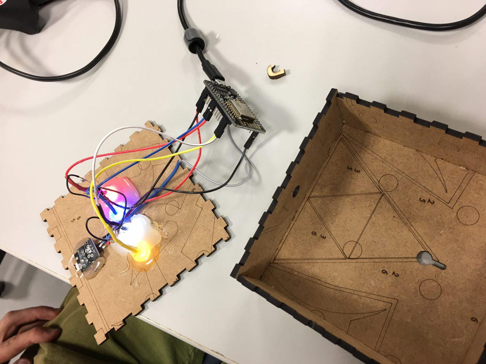
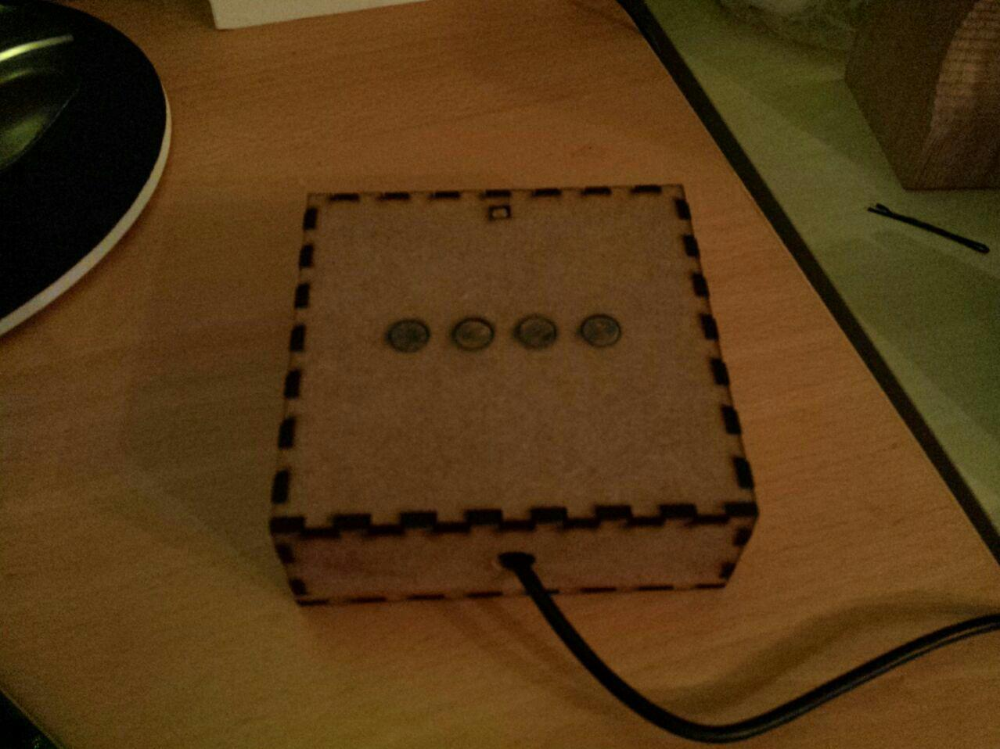

# Trashbox

Trashbox is quite a simple solution for quite a simple (or complicated?) task: not forgetting to take out the trask.
It's a simple laser cutted box containing four LEDs, a photo resistor a NodeMCU.

## Hardware

As already described, you need:

* 4 LEDs: one for each of your trash cans (for example red for the brown can, blue for paper, white for residual waste and yellow for the yellow bag), that and also the number of LEDs may highly depend on where you live of course, please see below for the software part
* Photo resistor: for not getting blind because of the LEDs when you wander through your apartment, you need this photo resistor
* NodeMCU: from somewhere the data must come and also something must control the LEDs, so why not wifi?!

## Software

The software part is written in MicroPython and depends on having the data available in a certain JSON format. This is why Trashbox, for the moment, only is working for the city Siegen in Germany. I would appreciate if you build stuff such as web scrapers so that this project is useful for others as well!

## Installation

You can either compile MicroPython for the ESP8266 on your own, flash it and put all the script files onto the device, or you can just clone this repository, attach your NodeMCU to your computer and use the install script:

    ~~~ bash
    git clone https://github.com/misterdanb/trashbox
    cd trashbox
    ./install.sh
    ~~~

The script asks you for some information and then installs the scripts and configurations to a precompiled MicroPython image and flashes this image onto the device.
